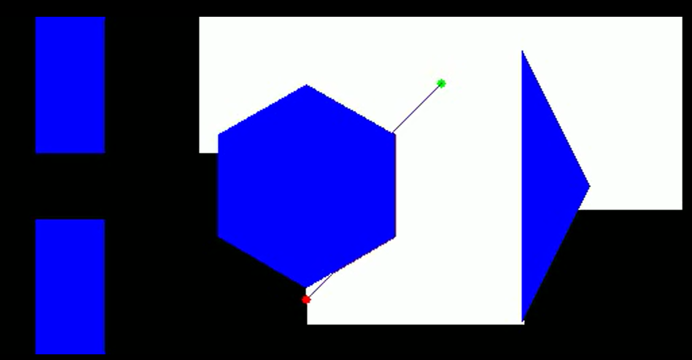

# Project 2 - ENPM 661 - Planning for Autonomous Robotics

Implementation of the Dijkstra Algorithm for a Point Robot

Required libraries - time, copy, opencv (4 and above), numpy, and heapq

Run code dijkstra_algo.py 

Enter the start position and goal position coordinate values as integers

Output - The final output is the video generated and saved on the system and it prints the total run time

Test case 1 - (5,5) and (550,240)
Test case 2 - (400,200) and (300,40)

